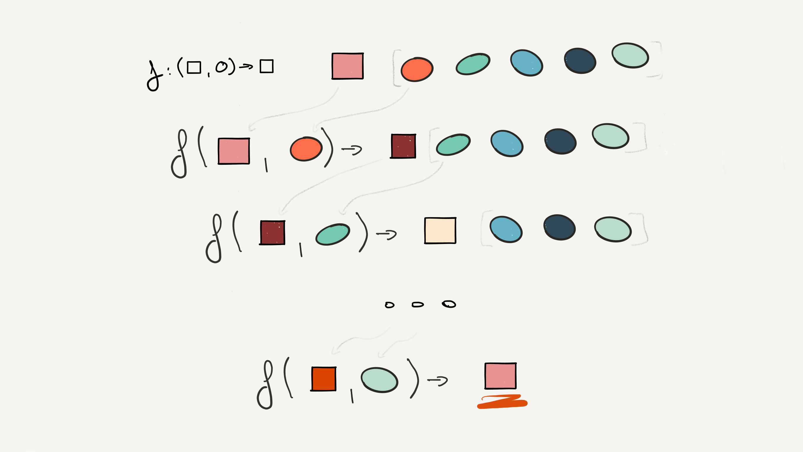
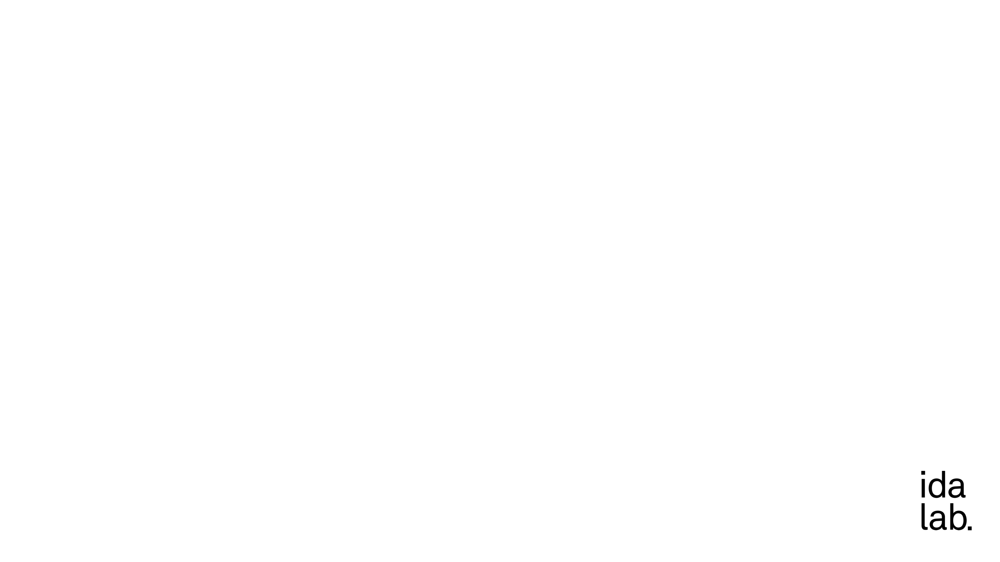

# Functional Programming in Python

—

# About me

Data Scientist @ idalab (mainly Python)
Used Ruby, JS, Python, Haskell for nontrivial projects
Played with Clojure, Scala, Erlang, Elixir

http://kirelabs.org/fun-js

—

# About this talk

- __Not__ a motivation of functional programming
- __How__ can FP by used in Python

^
Give you hints
Don’t _recommend_ you to use what I’m presenting here
Show you the entrance to the rabbit hole

—

# Disclaimer

> There should be one
> — and preferably only one —
> obvious way to do it.
-- [PEP 20 — The Zen of Python](https://www.python.org/dev/peps/pep-0020/)

—

# Disclaimer (cont)

The fate of `reduce()` in Python 3000

> not having the choice streamlines the thought process
-- [Guido van Rossum](https://www.artima.com/weblogs/viewpost.jsp?thread=98196)

—

# Functional Programming (in Python)

- first class functions
- higher order functions
- purity
- immutability
- composition
- partial application & currying
- recursion

—

# Functional Programming (in Python)

- first class functions
- higher order functions
- purity
- ~~immutability~~ (not today)
- composition
- partial application & currying
- ~~recursion~~ (neither)

—

# Purity

functions without side-effects

```python
def add(a, b):
	return a + b
	
additions_made = 0
def add(a, b):
	additions_made += 1
	return a + b
```

—

# First class functions

```python
def add(a, b):
	return a + b
	
add_function = add
	
add = lambda a,b: a + b
```

—

# higher order functions

```python
def timer(fn):
	def timed(*args, **kwargs):
		t = time()
		fn(*args, *kwargs)
		print "took {time}".format(time=time()-t)
		
	return timed

def compute():
	#…

timed_compute = timer(compute)
timed_compute()
```

—

# Decorators

```python
@timer
def compute():
    sleep(1)
    
compute()
```

—

# Partial function application

```python
def add1(num):
	return add(1, num)
add1(1)

# simpler
from functools import partial
add1 = partial(add, 1)
add1(1)
```

^
Toy example - just building up a toolbox for the fun stuff

—

# Currying

> […] transforming a function that takes multiple arguments in such a way that it can be called as a chain of functions, each with a single argument (partial application)
— Wikipedia

—

# Currying

```python
def curried_add(a):
	def inner(b):
		return add(a,b)
		
add(1)    # => <function …>
add(1)(1) # => 2
```

—

# Interlude: Closures

```python
def curried_add(a):
	def inner(b):
		return add(a,b)
		
add(1)    # => <function …>
add(1)(1) # => 2
```

—

## Currying example from the stdlib
#### `from operator import itemgetter, attrgetter, methodcaller`

```python
obj.method()

from operator import methodcaller
methodcaller("method")(obj)
```

^
We will see how this is useful

—

## [fit] Functional collection transformations

—

# map

```python
map(f, iter)

[f(el) for el in seq]
```

—

# filter

```python
filter(p, seq)

[el for el in seq if p(el)]
```

—

# reduce

```python
from functools import reduce
reduce(f, seq, initial)

result = initial
for el in seq:
	result = f(result, el)
```

—



—

# function composition

```python
[f(x) for x in seq if p(x)]

map(f, filter(p, seq))

from toolz.curried import compose, map, filter
compute = compose(map(f), filter(p))
compute(seq)
```

^
Illustrational purposes

—

# Example: A bad CSV parser (1/3)

```python
csv = """firstName;lastName
Jim;Drake
Ben;James
Tim;Banes"""

target = [{'firstName': 'Jim', 'lastName': 'Drake'},
          {'firstName': 'Ben', 'lastName': 'James'},
          {'firstName': 'Tim', 'lastName': 'Banes'}]
```

—

# Example: Imperative Python (2/3)

```python
lines = csv.split("\n")
matrix = [line.split(';') for line in lines]
header = matrix.pop(0)
records = []
for row in matrix:
    record = {}
    for index, key in enumerate(header):
        record[key] = row[index]
    records.append(record)
```

—

# Example: Functional Python (3/3)

```python
from toolz.curried import compose, map
from functools import partial
from operator import methodcaller

split = partial(methodcaller, 'split')
split_lines = split("\n")
split_fields = split(';')
dict_from_keys_vals = compose(dict, zip)
csv_to_matrix = compose(map(split_fields), split_lines)

matrix = csv_to_matrix(csv)
keys = next(matrix)
records = map(partial(dict_from_keys_vals, keys), matrix)
```

—

# Example: PySpark

```bash
docker run --rm -v ${PWD}:/home/jovyan/work -p 8888:8888 jupyter/pyspark-notebook
```

```python
def sample(p):
    x, y = random(), random()
    return 1 if x*x + y*y < 1 else 0

count = sc.parallelize(range(0, NUM_SAMPLES)) \
	.map(sample) \
	.reduce(lambda a, b: a + b)
print("Pi is roughly %f" % (4.0 * count / NUM_SAMPLES))
```

^
http://spark.apache.org/docs/latest/programming-guide.html#transformations

—

# Example: K-Means
#### (Stolen and modified from Joel Grus)

```python
def kmeans(points, k):
	return until_convergence(
		iterate(
			find_new_means(points),
			random.sample(points, k)))
```

—

```python
def until_convergence(it):
    return last(accumulate(no_repeat, it))
    
def no_repeat(prev, curr):
    if prev == curr: raise StopIteration
    else: return curr
```

—

```python
import random
from toolz.curried import iterate, accumulate, curry, groupby, last, compose

def kmeans(k, points):
    return until_convergence(iterate(find_new_means(points), random.sample(points, k)))
    
@curry
def find_new_means(points, old_means):
    k = len(old_means)
    clusters = groupby(compose(str, closest_mean(old_means)), points).values()
    return list(map(cluster_mean, clusters))
```

—

```python
@curry
def closest_mean(means, point):
    return min(means, key=squared_distance(point))

@curry
def squared_distance(p, q):
    return sum((p_i - q_i)**2 for p_i, q_i in zip(p, q))
```

—

```python
def cluster_mean(points):
    num_points = len(points)
    dim = len(points[0]) if points else 0
    sum_points = [sum(point[j] for point in points)
                  for j in range(dim)]
    return [s / num_points for s in sum_points]
```

—

# Main takeaways

- FP is possible in Python (to a degree)
- small composable functions are good
- FP == build general tools and compose them

^
Functional programming enables writing small composable functions
Decide for yourself and with your team if this is a good idea

—

# [fit] Whats missing in Python (or what I am missing)

- More list functions
- Nicer lambda syntax
- Automatic currying, composition syntax
- ADTs (sum types)[^*]
- Pattern Matching

[^*]: Possible but ugly [http://stupidpythonideas.blogspot.de/2014/08/adts-for-python.html](http://stupidpythonideas.blogspot.de/2014/08/adts-for-python.html)

—

# Functional libraries
## (More list functions)

- http://toolz.readthedocs.io/en/latest/
- https://github.com/kachayev/fn.py
- http://pedrorodriguez.io/PyFunctional/

—

# Nicer lambda syntax

```python
map(lambda x: x**2, range(5)) # => [0, 1, 4, 9, 16]

from fn import _
map(_**2, range(5)) # => [0, 1, 4, 9, 16]
```

^
Might not work as expected in i.e. PySpark

—

# Other interesting stuff

- Separation of pure code and sideeffects:
[https://pypi.python.org/pypi/effect/](https://pypi.python.org/pypi/effect/)
- Persistent immutable data structures
[https://pypi.python.org/pypi/pyrsistent/](https://pypi.python.org/pypi/pyrsistent/)
- [https://docs.python.org/3/howto/functional.html](https://docs.python.org/3/howto/functional.html)

—

## Other talks (where I have stolen material)

- [http://kachayev.github.io/talks/uapycon2012/](http://kachayev.github.io/talks/uapycon2012/)
- [https://vimeo.com/80096814](https://vimeo.com/80096814)
- [https://github.com/joelgrus/stupid-itertools-tricks-pydata](https://github.com/joelgrus/stupid-itertools-tricks-pydata)
- [http://kirelabs.org/fun-js](http://kirelabs.org/fun-js)

^
Matthew Rocklin PyData NYC 2013 - pytoolz
ALEXEY KACHAYEV PyCon UA 2012 - fn.py
Joel Grus: PyData Seattle 2015

—

## More FP?

- SICP ([http://deptinfo.unice.fr/~roy/sicp.pdf](http://deptinfo.unice.fr/~roy/sicp.pdf))
- [http://learnyouahaskell.com/](http://learnyouahaskell.com/)
- Real World Haskell ([http://book.realworldhaskell.org/read/](http://book.realworldhaskell.org/read/))

—



# Thank you
Daniel Kirsch
[daniel.kirsch@idalab.de](mailto:daniel.kirsch@idalab.de)
[@kirel](http://twitter.com/kirel)
[https://github.com/kirel/functional-python](https://github.com/kirel/functional-python)